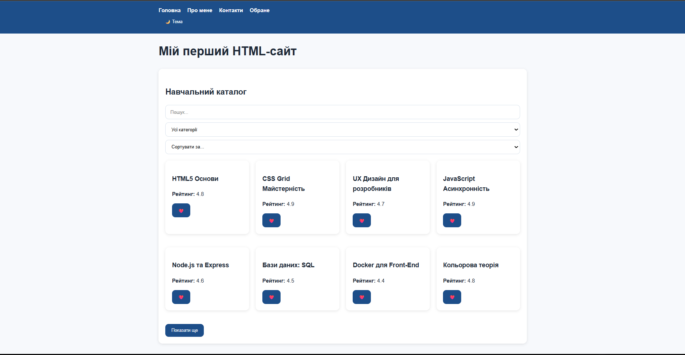
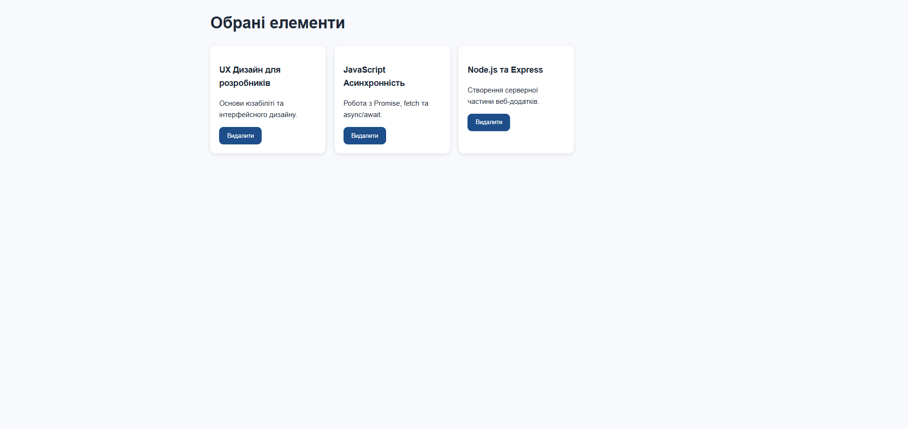
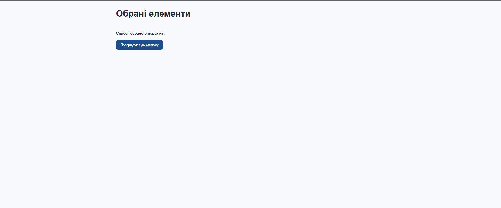

# 🚀 Мій перший веб-сайт (HTML + CSS + JavaScript)

Це навчальний багатосторінковий веб-сайт, створений у рамках дисципліни **Front-End розробки**. Проєкт демонструє базові та просунуті навички створення інтерактивних інтерфейсів.

---

## 🛠 Технології
* **HTML5** – семантична структура сторінок.
* **CSS3** – стилізація, адаптивність та робота з темами.
* **JavaScript** – логіка інтерактивності, асинхронність та робота з даними.

---

## ✨ Основні можливості

### 🎨 Інтерфейс
* **Адаптивна верстка:** Сайт коректно відображається на різних пристроях.
* **Темна/Світла тема:** Збереження вибору користувача в `localStorage`.
* **Інтерактивність:** Акордеони, кнопка "Вгору" з плавним скролом, автоматичне оновлення року у футері.

### ⚙️ Функціонал JavaScript
* **Робота з формами:** Валідація полів (Name, Email, Message) та збереження чернеток.
* **Каталог:** * Асинхронне завантаження даних (`fetch`).
    * Робота зі станами завантаження та помилок.
    * Пошук у реальному часі та фільтрація категорій.

---

## 📂 Структура проєкту

first_web_cite/
├── data/
│   └── items.json      # Структуровані дані каталогу
├── js/
│   ├── main.js         # Головна логіка (каталог, фільтри)
│   └── favorites.js    # Логіка сторінки "Обране"
├── pages/
│   ├── about.html
│   ├── contact.html
│   └── favorites.html  # Сторінка обраного
├── styles/
│   ├── style.css
│   └── responsive.css
└── index.html

### Як запустити проєкт
Клонуйте репозиторій:
git clone https://github.com/VladMakhun/first_web_cite.git

Важливо: Для коректної роботи fetch() обов'язково запустіть проєкт через розширення Live Server у VS Code (або будь-який інший локальний сервер), оскільки пряме відкриття файлів через file:// блокує запити до JSON.№

### Автор
Махун Владислав 232/1

