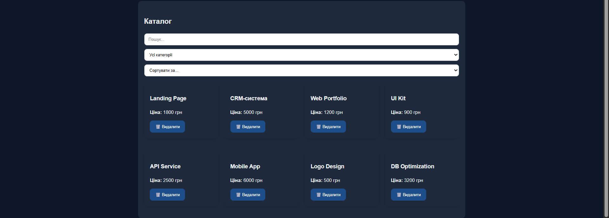
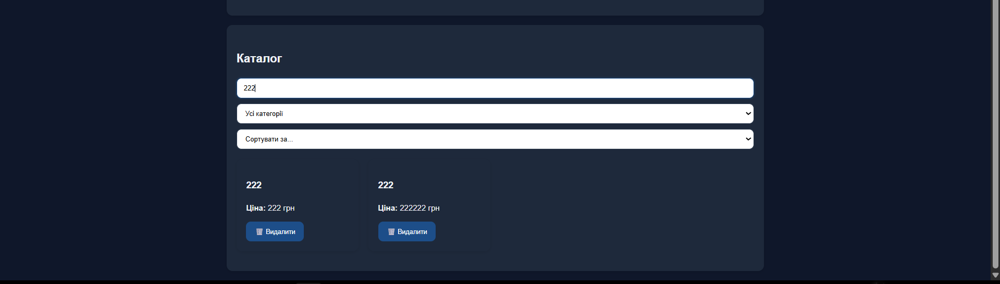
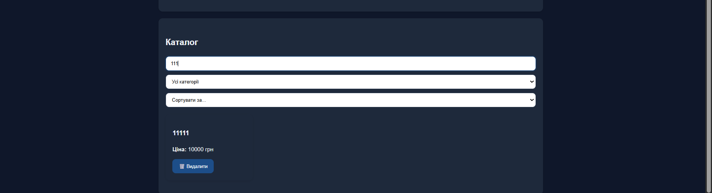

### 🚀 Навчальний веб-каталог (CRUD & REST API)
Це оновлений навчальний проєкт, розроблений у межах дисципліни Front-End розробки. Проєкт еволюціонував від статичного багатосторінкового сайту до інтерактивного веб-додатка з використанням REST API.

### 🛠 Технологічний стек
HTML5 & CSS3 (з підтримкою темної/світлої теми).

JavaScript (ES6+) – модульна архітектура, асинхронні запити.

REST API – робота з JSON-сервером для динамічного керування даними.

###  Реалізований функціонал (CRUD)
Виконано 10 основних завдань практичної роботи:

REST API: Налаштування та робота з ресурсом через json-server.

Модульна архітектура: Створено окремий API-шар (api.js) для всіх HTTP-операцій.

GET-запити: Динамічний рендеринг каталогу товарів із сервера.

Стани інтерфейсу: Реалізовано обробку станів loading, error та empty.

POST-запити: Форма створення нових елементів з клієнтською валідацією.

Редагування: Реалізація PATCH/PUT запитів для оновлення записів.

Видалення: Функціонал DELETE із підтвердженням дії користувача.

Пошук та фільтрація: Повноцінна робота з категоріями, пошуком та сортуванням.

Синхронізація: Актуалізація інтерфейсу в реальному часі після будь-яких змін даних.

UX/UI: Кастомні модальні вікна, валідація форм та збереження теми оформлення в localStorage.

📂 Структура проєкту
Plaintext
first_web_cite/
├── db.json             # Локальний серверний ресурс (Mock API)
├── js/
│   ├── api.js          # API-шар (fetch запити)
│   ├── main.js         # Основна бізнес-логіка та CRUD
│   └── ...             # Ініціалізація компонентів
├── styles/
│   └── style.css       # Стилі з підтримкою теми .theme-dark
└── index.html          # Головний шаблон додатка
### 🚀 Як запустити проєкт
Клонуйте репозиторій:

Bash
git clone https://github.com/VladMakhun/first_web_cite.git
Запустіть API-сервер:
(Переконайтеся, що у вас встановлено Node.js)

Bash
npx json-server --watch db.json --port 3000
Запустіть фронтенд:
Відкрийте index.html за допомогою Live Server у VS Code.

### Автор: Махун Владислав (студент групи 232/1)

